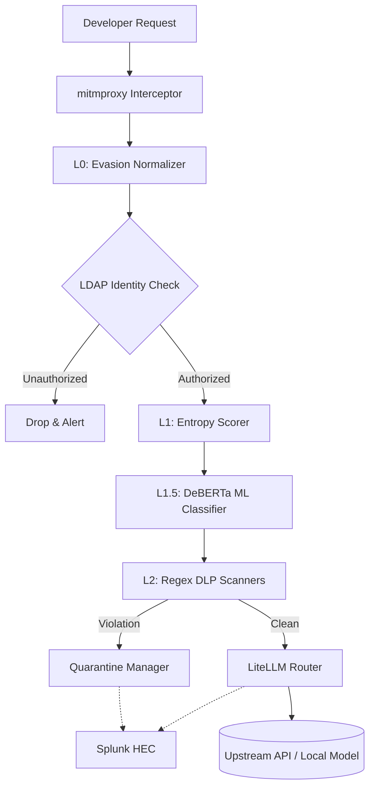

# 🧠 AI-CASB Engine (Security Gateway)

The `cloud-sec-gateway` is the core enforcement node of the **AI-SOC** platform. It operates as an identity-aware, inline transparent proxy that intercepts, inspects, and routes traffic between developer endpoints and external AI providers.

Whether your developers are using IDE extensions like **GitHub Copilot**, **Cline**, or **Continue** to hit external APIs like **OpenAI**, **Anthropic**, or aggregator endpoints like **OpenRouter**, this gateway acts as the central choke point.

This component is responsible for the actual "heavy lifting" of the security stack, performing real-time LDAP lookups, ML-based prompt classification, and sending telemetry to the SIEM before the prompt ever leaves the corporate network.

---

## 🏗️ Internal Architecture



## ✨ Gateway Capabilities

### 1. The 8-Layer Inspection Pipeline
- **Evasion Defense**: Normalizes unicode attacks, leetspeak, and homoglyphs.
- **Base64/Entropy**: Blocks high-entropy payloads used for data exfiltration.
- **DeBERTa ML Engine**: Uses a localized huggingface model to semantically detect "jailbreaks" and "prompt injections" that bypass standard regex.
- **Regex DLP**: 7 built-in rules for PII, AWS Keys, SSNs, and internal IPs with hot-reload support.

### 2. OpenLDAP RBAC Binding
- Authenticates the user generating the traffic in real-time.
- Supports role-based access control (e.g., assigning higher rate limits or permissive DLP rules to the `ai_users` LDAP group).

### 3. Risk Scoring & Quarantine Engine
- Maintains a stateful risk score for every IP/User.
- Violations increase the score. At a score of `80`, the gateway automatically triggers a network-level quarantine, cutting off all LLM access.
- Generates enriched JSON logs sent directly to Splunk and Wazuh for incident creation in DFIR-IRIS.

### 4. Command Center Dashboard
- Serves the `dashboard/index.html` frontend via a Flask API (`dashboard_server.py`).
- Allows SOC Analysts to manage active DLP rules, review quarantined endpoints, and reset risk scores.

---

## 🚀 Running the Gateway

If you have completed the **Phase 1 Prerequisites** (Splunk & LDAP deployed) from the root repository, you can start the gateway here.

### 1. Environment Setup
```bash
python3 -m venv venv
source venv/bin/activate
pip install -r requirements.txt
```

### 2. Configuration
Copy `.env.example` to `.env` and fill in the necessary secrets:
```env
SPLUNK_HEC_TOKEN="your-splunk-token"
LDAP_SERVER="ldap://192.168.100.10"
LDAP_BIND_DN="cn=admin,dc=aisoc,dc=local"
LDAP_PASSWORD="your-ldap-password"
```

Update `config.yaml` with your upstream LLM routing configurations (LiteLLM format).

### 3. Start the Daemon
```bash
./start_casb.sh
```
This script launches:
1. The background Risk Scoring Daemon.
2. The Flask Command Center API (`port 5001`).
3. The mitmproxy + LiteLLM interception server (`port 4000`).

---

## 🧪 Testing the Engine

You can test the inspection engine locally using `curl`:

**Test an authorized prompt:**
```bash
curl -x http://localhost:4000 http://api.openai.com/v1/chat/completions \
  -H "X-User-ID: developer_account" \
  -H "Content-Type: application/json" \
  -d '{"model": "gpt-4", "messages": [{"role": "user", "content": "How do I reverse a binary tree?"}]}'
```

**Test a DLP Violation (IP Address):**
```bash
curl -x http://localhost:4000 http://api.openai.com/v1/chat/completions \
  -H "X-User-ID: developer_account" \
  -H "Content-Type: application/json" \
  -d '{"model": "gpt-4", "messages": [{"role": "user", "content": "Connect to my database at 10.0.5.55"}]}'
```

**Test an Unauthorized LDAP User:**
```bash
curl -x http://localhost:4000 http://api.openai.com/v1/chat/completions \
  -H "X-User-ID: guest_account" \
  -H "Content-Type: application/json" \
  -d '{"model": "gpt-4", "messages": [{"role": "user", "content": "Tell me a joke"}]}'
```
*(This should return a 403 Forbidden).*
